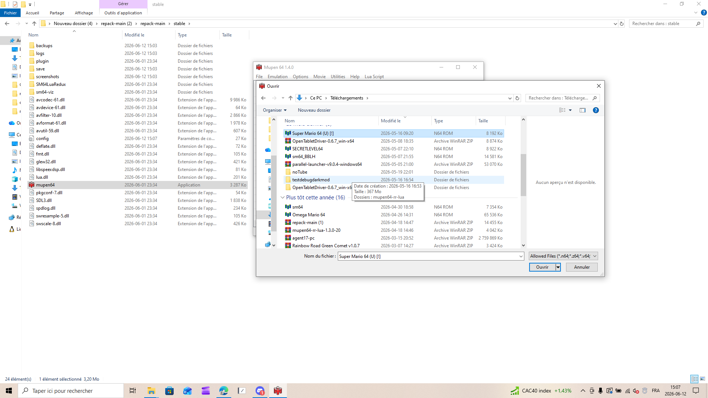
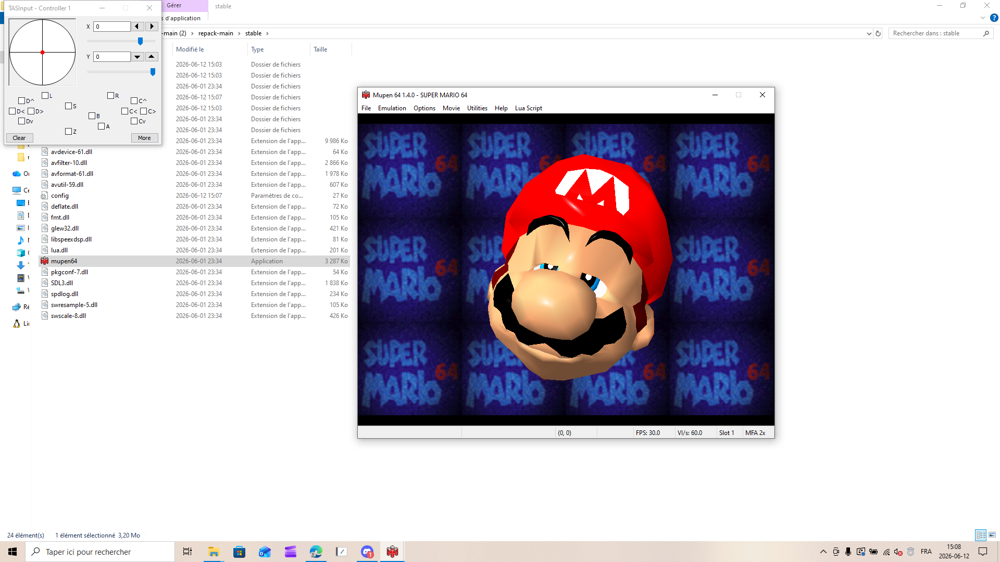
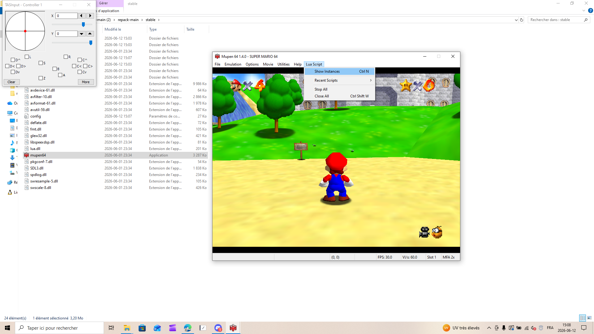

# Mupen64 Quick Start Guide

Get up and running with Mupen64 in minutes.

---

## 1. Download

Go to **https://mupen64.com** and click the **Download** button.

> **Note:** Mupen64 is a portable application. No installer needed.

---

## 2. Extract

Extract the downloaded ZIP file to a folder of your choice.

Open the extracted folder and navigate to `repack-main > stable`. You will see the emulator files including `mupen64.exe`.

---

## 3. Launch

Double-click **mupen64.exe** to start the emulator.

---

## 4. Load a ROM

1. Go to **File > Load ROM** (or press `Ctrl + O`).

   

2. Browse to your N64 ROM file (`.n64`, `.z64`, `.v64` formats supported) and click **Open**.

   

3. Your game starts automatically. The TAS Input window appears alongside the game.

   

---

## 5. SM64 Lua Redux (Optional)

For Super Mario 64 speedrunners, the SM64 Lua Redux overlay provides real-time data (position, speed, angles, RNG, inputs).

### 5.1 Open Lua Instances

With a ROM running, go to **Lua Script > Show Instances** (`Ctrl + N`).

### 5.2 Add the Script

Click **Add Instance**, then browse to the `SM64LuaRedux > src` folder and select `SM64Lua.lua`.

### 5.3 Start the Script

Click **Start** to run the script.

The overlay now displays live game data on the right side of the game window.

---

## Quick Reference

| Key | Action |
|-----|--------|
| `Ctrl + O` | Load ROM |
| `Ctrl + S` | Settings |
| `Ctrl + N` | Show Lua Instances |
| `F1` - `F4` | Save state to slot 1-4 |
| `Shift + F1` - `F4` | Load state from slot 1-4 |

---

*Mupen64 v1.4.0 - https://mupen64.com*
