# Quickstart Guide

Get up and running with Mupen64 in minutes.

---

## 1. Download

Go to https://mupen64.com and click the Download button.

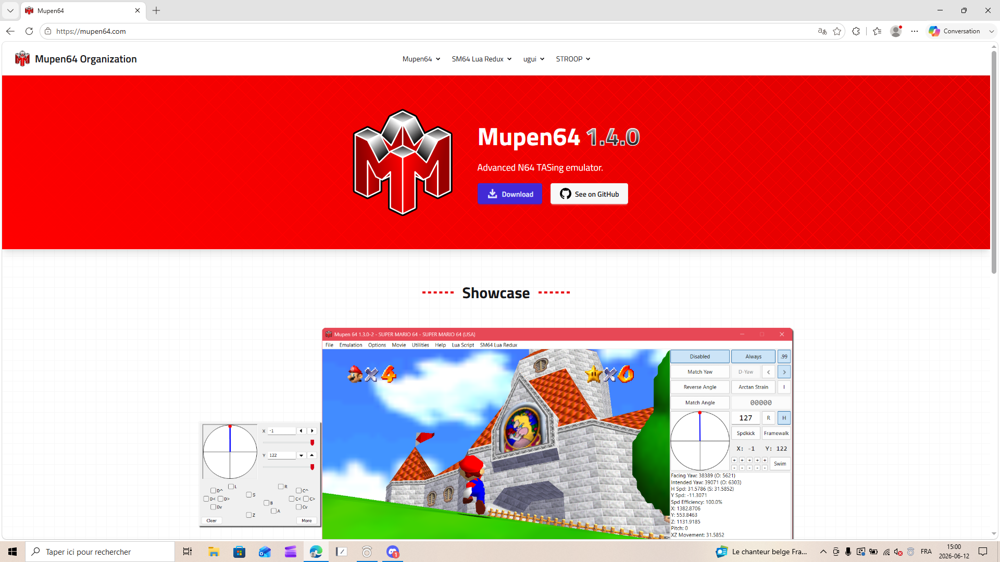

> **Note:** Mupen64 is a portable application. No installer needed.

---

## 2. Extract

Extract the downloaded ZIP file to a folder of your choice.

Open the extracted folder and navigate to `repack-main/stable`. You will see the emulator files including `mupen64.exe`.

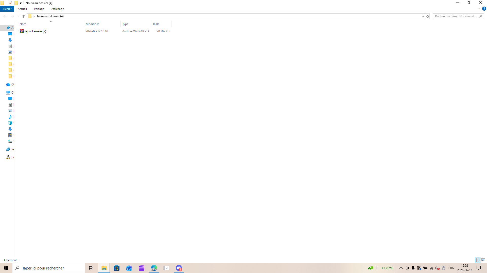

---

## 3. Launch

Double-click **mupen64.exe** to start the emulator.

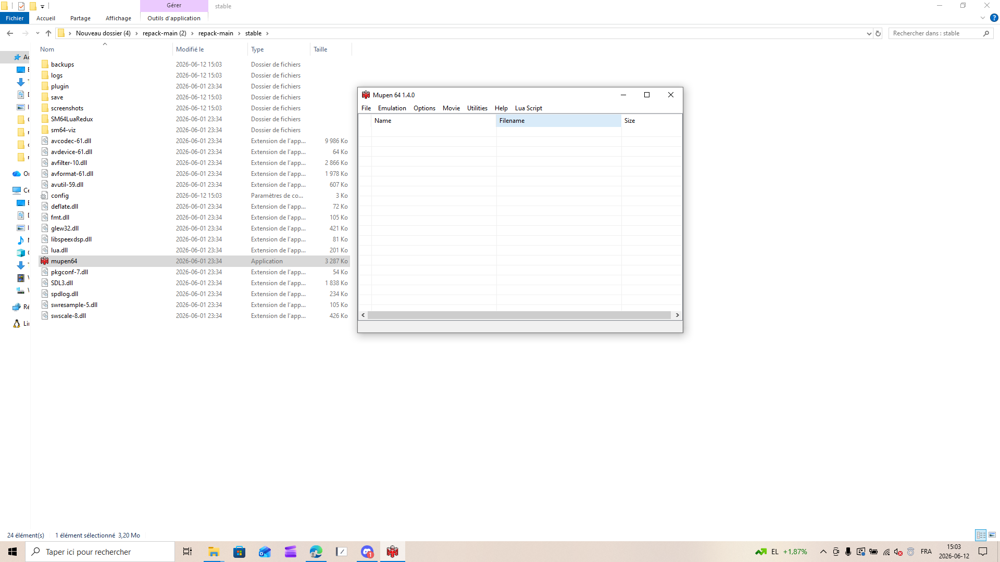

---

## 4. Define a ROM folder

Mupen64 can list your games by pointing it to a folder that contains your N64 ROMs.

1. Open **Settings** (press `Ctrl + S`) and select the **Folders** tab.

   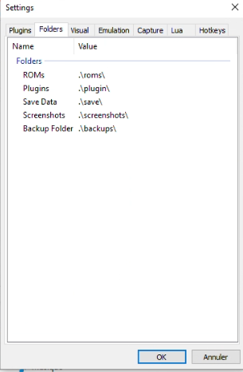

2. Next to **ROMs**, click the browse button and select the folder where your `.n64`, `.z64`, or `.v64` ROMs are stored.

   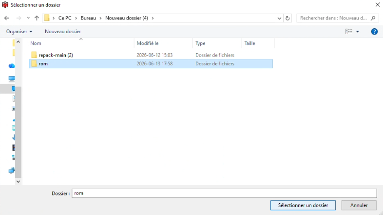

3. Click **OK** to save. The **ROMs** path now points to your chosen folder.

   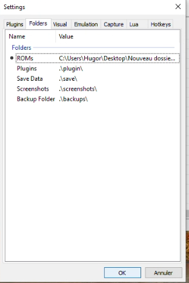

4. The main window now lists every ROM found in that folder. Double-click a game to start it. The TAS Input window appears alongside the game.

   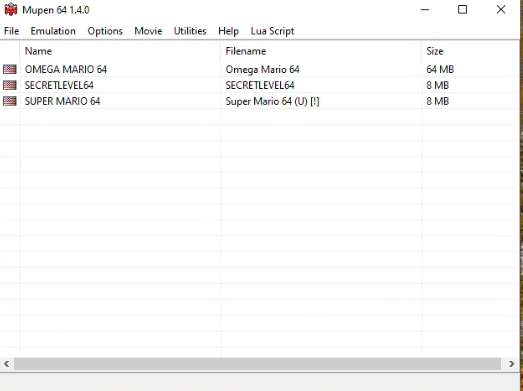

---

## 5. SM64 Lua Redux (Optional)

For Super Mario 64 speedrunners, the SM64 Lua Redux overlay provides real-time data (position, speed, angles, RNG, inputs).

### 5.1 Open Lua Instances

With a ROM running, go to **Lua Script > Show Instances** (`Ctrl + N`).

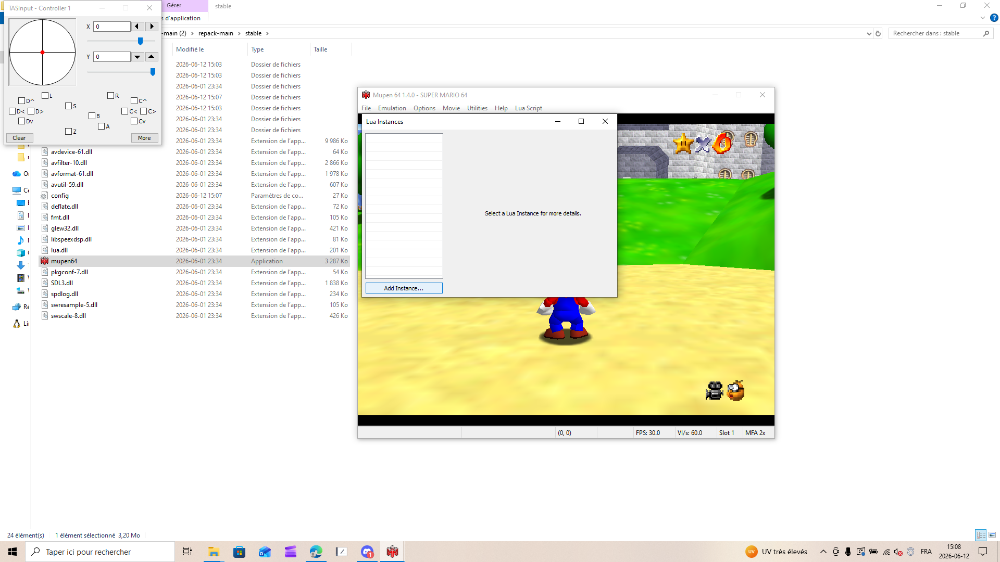

### 5.2 Add the Script

You can add the script in one of two ways:

- Click **Add Instance**, then browse to the `SM64LuaRedux/src` folder and select `SM64Lua.lua`.

  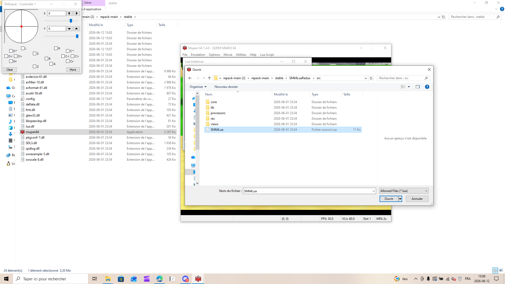

- Or drag and drop `SM64Lua.lua` directly from the `SM64LuaRedux/src` folder onto the Mupen64 window.

  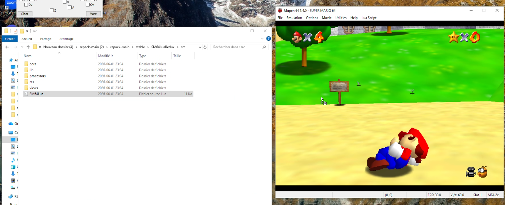

### 5.3 Start the Script

Click **Start** to run the script.

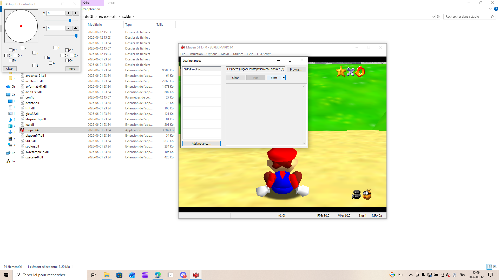

The overlay now displays live game data on the right side of the game window.

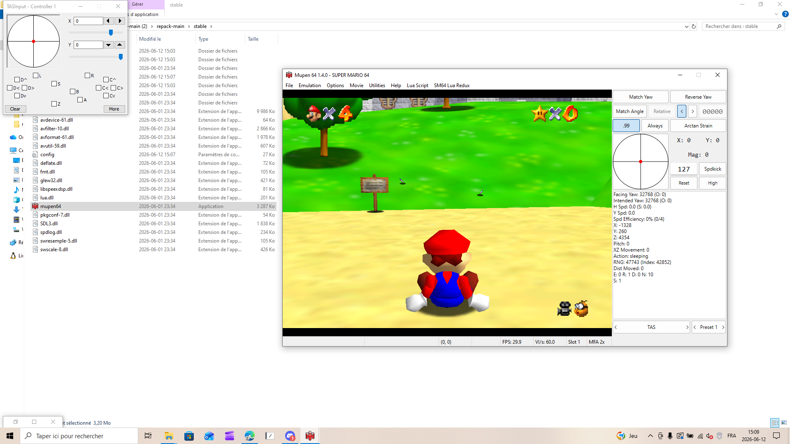

---

## Common Keyboard Shortcuts

| Key | Action |
|-----|--------|
| `Ctrl + O` | Load ROM |
| `Ctrl + S` | Settings |
| `Ctrl + N` | Show Lua Instances |
| `F1` - `F4` | Save state to slot 1-4 |
| `Shift + F1` - `F4` | Load state from slot 1-4 |

---
